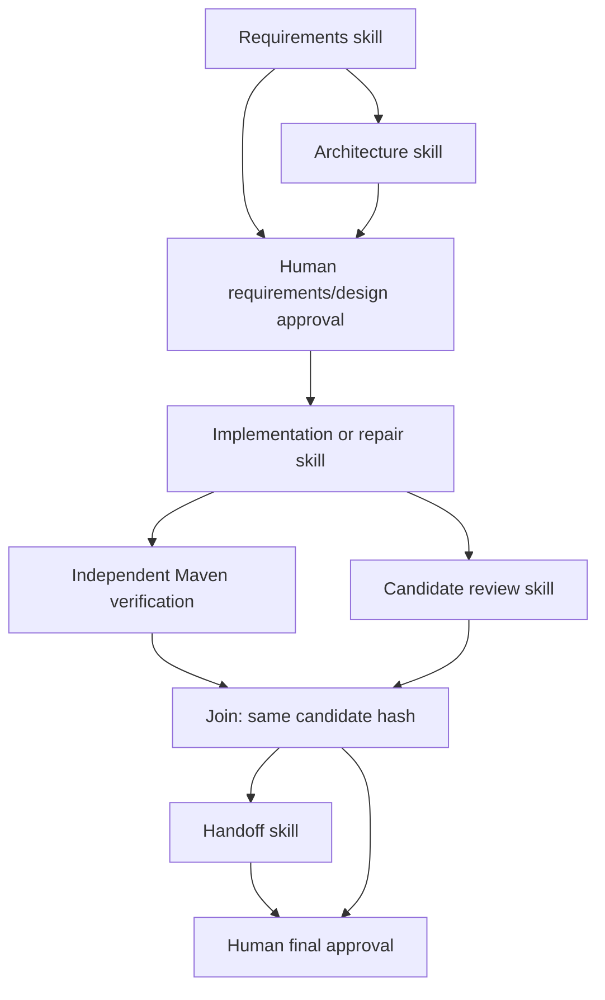

# Operating the local engineering workflow

The control layer persists plans, task dependencies, attempt reservations, decisions, approvals, and event history in H2. Skills provide engineering procedures. Model output is evidence or a proposal; it cannot approve itself, change execution commands, deploy, or merge into the original checkout.

## Create and inspect a run

Start the service using the root README. In your local terminal, load the token without printing it:

```bash
OPERATOR_TOKEN="$(cat .local-data/operator-token)"
curl -i http://localhost:8080/api/v1/workflow-runs \
  -H "Authorization: Bearer $OPERATOR_TOKEN" -H 'Content-Type: application/json' \
  -d '{"scenario":"greenfield","requirement":"Implement the LinkBook contract in README.md and preserve the supplied acceptance tests.","ambiguous":false}'
```

Only the fixed `greenfield`, `brownfield`, and `ambiguous` fixture IDs are accepted. With `workflow.scenario-fixtures=true`, they resolve beneath the configured trusted project root. This avoids allowing callers to select arbitrary host directories. Set `workflow.scenario-fixtures=false` only for an explicitly reviewed full-project input; that remains an executable-code trust decision.

The workflow has five authenticated operations:

| Method | Path | Purpose |
|---|---|---|
| POST | `/api/v1/workflow-runs` | Start a scenario |
| GET | `/api/v1/workflow-runs/{id}` | Read its complete report |
| POST | `/api/v1/workflow-runs/{id}/approvals` | Approve or reject the exact current gate |
| POST | `/api/v1/workflow-runs/{id}/clarifications` | Record an answer and create a revised workflow |
| POST | `/api/v1/workflow-runs/{id}/cancel` | Stop the run |

The single GET response contains current state/version/tasks, graph revisions, attempt history, events, approvals, metrics, and `reviewEvidence`. Published evidence is checked against its recorded hash before being included. `structuredResult` contains the agent's summary, questions, proposed tasks, and risks. Verifier evidence includes the last 16,000 characters of actual output, `verifierOutputTruncated`, and `fullOutputHash`. The `evidenceHash` binds the original evidence file, not the compact review projection. Raw transcripts stay in the immutable owned evidence store; a saved GET report contains the compact projection. Removed event/report/evidence routes have no compatibility aliases.

Reports contain task inputs and captured engineering narratives. Treat them as local project material and review before sharing. Operator credentials are removed from child environments; the CLI uses its own existing sign-in.

## Locate and export a candidate

After implementation succeeds, inspect the current revision in the complete report. Find its successful `implementation` entry in `attemptHistory` and use that entry's `id` (not `invocation_id`). The published project is at `<workflow.workspace-root>/<run-id>/candidates/<attempt-id>`; the default workspace root is `.local-data/workflow`. Match its reported `candidate_hash` with the verifier and review evidence for the same revision. A pending or failed implementation has no approved candidate to hand off.

For submission, copy that published project into a new export directory and save the complete GET report alongside it. Preserve the original files from `<workflow.workspace-root>/<run-id>/evidence/` separately when full transcripts and byte-for-byte evidence are needed. Include the run ID, revision, candidate hash, and final approval status. Exporting does not merge changes into this checkout or approve the final candidate; leave the owned snapshots unchanged and keep the operator token and live database out of the export.

## Dependencies and human gates



The initial graph has two human gates: `design-approval` and `final-approval`. A gate becomes `AWAITING_APPROVAL` only after current predecessor evidence exists. Review that evidence and submit:

```json
{
  "revision": 1,
  "version": 4,
  "taskId": "design-approval",
  "evidenceHash": "copy-the-current-gate-hash",
  "approved": true,
  "rationale": "Human reviewed this exact requirements/design evidence."
}
```

Send it to `POST /api/v1/workflow-runs/{id}/approvals` with the bearer token. Use the exact current revision, run version, and gate evidence hash returned by inspection; example numbers are illustrative. Changed versions, dependencies, skills, or artifacts invalidate old evidence. Approval records derive identity from the authenticated operator, never a caller-supplied actor or model field. An agent process receives no operator token.

Coding, testing, and up to two repair cycles proceed automatically inside the approved scope. Final approval requires review of the actual candidate and validation evidence. Wider deployment, publication, destructive migration, external messages, or material scope changes are outside this prototype's automatic authority.

Final full-application Maven verification passed all 87 tests after the latest changes, including both regression cases preserving clarification when a parallel verifier fails. The three scenario candidates are also independently reverified; fixture evidence is separate from application tests. Runtime verification is offline, so its dependency cache must already be prepared as described in the root README.

## Ambiguity and replanning

An ambiguous run starts in `AWAITING_INPUT`. For “make links permanent and improve analytics,” clarify whether permanence means no expiry, fixed destination, or an HTTP permanent redirect, and specify count semantics. Send the concrete answer to `POST /{id}/clarifications`:

```json
{"version":1,"answer":"Keep optional expiration, fixed destinations, and temporary redirects. Keep total and UTC daily recorded counts; HEAD and failed resolutions do not count."}
```

The engine creates a new revision and conservatively invalidates prior work and approvals. Workflow definitions are maintained in code; callers cannot submit arbitrary task graphs. The fixed graph includes the mandatory roles, design/final gates, complete dependencies, and a verification join. Each revision has one candidate-writing implementation task followed by parallel read-only verification and review.

Questions from requirements, architecture, implementation, or review pause the run in `AWAITING_INPUT`; `pendingQuestions` and immutable evidence preserve the actual questions. A human clarification creates a new revision and requires fresh design approval. Handoff questions are preserved as `finalReviewItems` and presented at the mandatory final approval gate. They never count as approval. If another parallel task fails while the run is `AWAITING_INPUT`, its failure and evidence are retained without retry or automatic repair. The clarification pause and revision remain in place until a human answer creates a revised plan.

A narrowly recognized legacy handoff-question stop can use the clarification endpoint after validating its exit-zero structured result and all completed candidate evidence. This recovery preserves the failed attempt, consumed budget, and stop event, then creates a new revision with fresh design review. Generic fatal, unknown, cancelled, or expired runs cannot use this path.

## Recovery boundaries

- Two workers at most; dispatch reserves a durable attempt, invocation ID, input hash, deadline, and time budget before starting a process.
- Agent deadline at most ten minutes, verifier at most five, aggregate active budget sixty minutes, human wait twelve hours. `activeExecutionMs` sums elapsed worker-attempt time: a five-minute verifier and a ten-minute review consume fifteen minutes of the run budget even when they overlap. Dispatch also accounts for outstanding deadline reservations before starting another attempt. Human waiting is reported separately and does not consume active execution time.
- Transient transport failures have at most three attempts. A failed verifier permits at most two scoped repair cycles, each followed by new verification/review of the new candidate.
- Leases and revision fences reject late completions. A changed skill or artifact cannot satisfy a current gate.
- Restart or an expired lease with unknown outcome preserves the consumed reservation, verifies process identity, terminates the owned external process where confirmed, and stops without blind AI replay. Uncertain identity leaves the workspace quarantined. Recovery reconciliation also runs when dispatch is disabled.
- `POST /{id}/cancel` prevents new claims and fences current results. Compensation restores only an owned attempt from its baseline. It does not roll back a deployment or the user's checkout.
- Existing fixture acceptance tests and Maven configuration are pinned. Added focused tests are permitted; weakening or removing the existing contracts is rejected.

The application validates paths and evidence hashes, but the local machine remains a trusted execution environment. Codex write sandboxing is not complete read/network isolation. Maven executes project code and plugins; arbitrary untrusted projects need stronger OS isolation. Audit events are application-level traceability, not tamper-proof compliance evidence.

Metric reports identify actual observations and unavailable values. A handful of scenarios is not a statistically meaningful reliability sample. Subscription monetary cost is unavailable, and token counts are only known when emitted by the CLI.
